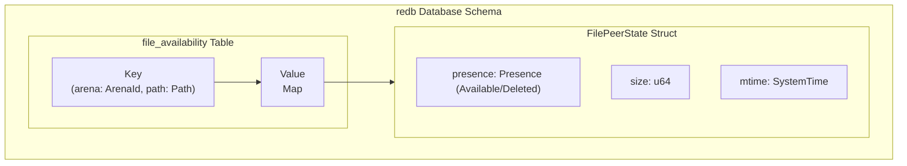

# The Unreal - A partial local cache of remote files as FS

## Overview

Export a filesystem using
[nfsserve](https://github.com/xetdata/nfsserve) based on a
[redb](https://github.com/cberner/redb/tree/master) database and local
(blob) storage.

The filesystem works as a cache for remote data. It caches all files
available on remote peers and makes them visible through the FS. When
a file is accessed, it is downloaded and added into the cache.

Initial implementation is read-only and rely on another filesystem
storing any local changes. See [The Real](real.md).

This will be extended later into a read-write implementation that
stores local modifications for MacOS and Windows support.

## Details

The Unreal cache is built upon a `redb` database that tracks the state of files across a household of peers. This allows the system to maintain a local understanding of remote file availability without constant network communication.

The initial implementation focuses on tracking file paths and their state. The more advanced blob-based storage with Merkle trees will be built on top of this foundation.

### Database Schema

The `redb` database will contain a primary table to store file availability information.



#### `file_availability` Table

This is the core table for tracking file status.

*   **Key**: `(model::Arena, model::Path)`
    *   A composite key made of the arena identifier and the file path. This provides a unique identifier for every file across all arenas.
    *   Using `model::Arena` and `model::Path` directly allows for type-safe queries. `redb` requires keys to be `Storable` and `Comparable`.

*   **Value**: `HashMap<model::PeerId, FilePeerState>`
    *   A map where each key is a peer's unique ID and the value is a struct describing the file's state on that specific peer. This provides a consolidated view of a file's status across the network.

### Data Structures

#### `FilePeerState`

This struct holds the metadata for a single file on a single peer.

```rust
// Conceptual representation
pub struct FilePeerState {
    pub presence: Presence,
    pub size: u64,
    pub mtime: SystemTime,
}
```

*   `presence`: An enum indicating whether the file is available or has been deleted on the peer.
*   `size`: The size of the file in bytes.
*   `mtime`: The last modification time of the file.

#### `Presence`

An enum to clearly represent the state of a file.

```rust
// Conceptual representation
pub enum Presence {
    Available,
    Deleted,
}
```

### Future Blob Storage (Recap)

While not part of the initial implementation step, the database will be extended to support blob-based storage:

*   **Blobs Table**: `hash -> reference count + (set of blob hash)|(path of block)`
*   **Merkle Trees**: File hashes will be constructed as Merkle trees to efficiently verify partial content.
*   **Block Storage**: Individual file blocks will be stored on disk, named by their hash.

This phased approach allows for an incremental build-out of the Unreal cache, starting with the essential file tracking mechanism.
